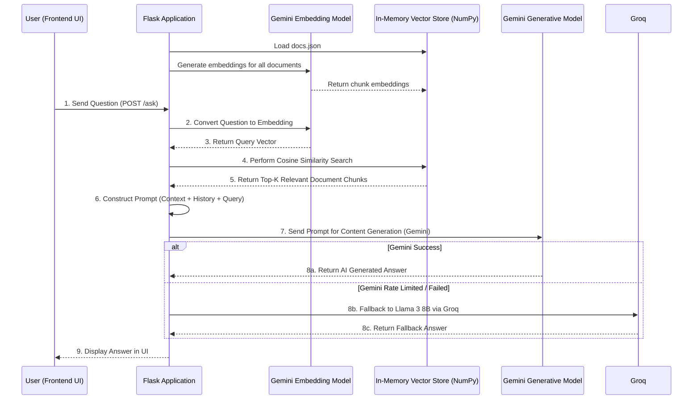

# GenAI Chat Assistant

A production-grade GenAI-powered chat assistant built using Retrieval-Augmented Generation (RAG). It serves as an intelligent question-answering system capable of providing contextually accurate responses based on a custom document knowledge base.

## 🚀 Features
- **Retrieval-Augmented Generation (RAG)**: Uses document chunks to provide context-aware answers.
- **Google Gemini API Integration**: Leverages `gemini-1.5-flash` for text generation and `gemini-embedding-001` for document embeddings.
- **Conversation History**: Maintains context of the recent conversation to provide meaningful follow-up answers.
- **Interactive UI**: A sleek, user-friendly frontend to interact with the assistant.

---

## 🛠️ What We Use & Why

| Technology         | What it is                    | Why we use it                                                                                              |
|--------------------|-------------------------------|------------------------------------------------------------------------------------------------------------|
| **Python / Flask** | Backend Web Framework         | Lightweight, easy to set up, and excellent for serving REST APIs to the frontend.                          |
| **Google GenAI**   | LLM & Embedding API           | Primary model (Gemini 1.5 Flash) for rapid text generation and highly accurate vector embeddings.            |
| **Groq (Llama 3)** | Fallback LLM API              | High-performance fallback model (Llama 3 8B) used if the primary Gemini quota is exhausted.                   |
| **NumPy**          | Math Library for Python       | High-performance vector operations to calculate **cosine similarity** for the retrieval system efficiently. |
| **HTML/CSS/JS**    | Frontend Stack                | To build an interactive, browser-based chat interface.                                                     |

---

## ⏰ When to Use This Project

- **Customer Support Bots**: When you need an automated agent to answer queries based on company FAQs or manuals.
- **Internal Knowledge Retrieval**: When employees need quick answers from large internal documents (HR policies, technical documentation).
- **Educational Tools**: When creating study assistants tailored to specific course materials.

---

## 🏗️ Architecture & Data Flow

Below is the architecture diagram depicting how a user's query is processed through the RAG pipeline to generate a final response.



## 📂 Project Structure

```text
genai-chat-assistant/
│
├── app.py                  # Main Flask application file natively handling RAG and APIs.
├── docs.json               # Document knowledge base (JSON format).
├── requirements.txt        # List of Python dependencies.
├── static/                 # Static files
│   └── styles.css          # Styles for the frontend UI.
└── templates/              # HTML templates
    └── index.html          # Main chat interface.
```

## ⚙️ How to Run

1. **Clone the repository** and navigate to the project directory:
   ```bash
   cd genai-chat-assistant
   ```

2. **Set up a Virtual Environment**:
   ```bash
   python -m venv venv
   # On Windows:
   venv\Scripts\activate
   # On macOS/Linux:
   source venv/bin/activate
   ```

3. **Install Dependencies**:
   ```bash
   pip install -r requirements.txt
   ```

4. **Environment Variables**:
   Create a `.env` file in the root directory and add your Google API key:
   ```env
   GOOGLE_API_KEY=your_google_api_key_here
   ```

5. **Run the Application**:
   ```bash
   python app.py
   ```

6. **Access the UI**:
   Open a web browser and go to `http://127.0.0.1:5000/`
